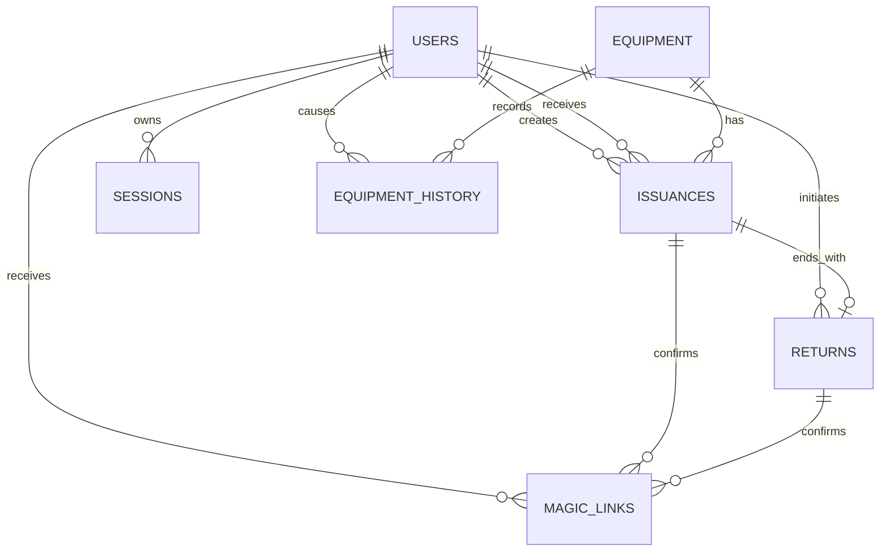

# MVP-Domänenmodell, Datenmodell und Geschäftsregeln

Diese Seite ist die fachliche Referenz für die Persistenz aus Issue #4 und den
API-Vertrag aus Issue #10. Sie beschreibt den MVP einer einzelnen
Rettungshundestaffel. Die erste Staffel ist fest im Scope; es gibt im MVP keine
Mandanten-, Staffel- oder Organisationsauswahl.

## 1. Begriffe und Leitentscheidungen

| Begriff | Verbindliche Bedeutung |
| --- | --- |
| Equipment | Ein einzelnes physisches Objekt. Seriennummer und Objekt-ID identifizieren dasselbe Objekt nicht austauschbar. |
| Ausgabe | Fachlicher Vorgang, der ein Equipment einem Mitglied zuordnet. Der Vorgang bleibt nach Rückgabe erhalten. |
| Rückgabe | Fachlicher Vorgang, der eine Ausgabe beendet. Sie ist kein eigener aktueller Equipment-Status. |
| auf Lager | API-Status `on_stock`: Das Equipment hat keine aktive bestätigte Ausgabe und kann ausgegeben werden. |
| ausgegeben | API-Status `issued`: Das Equipment hat genau eine aktive bestätigte Ausgabe an ein Mitglied. |
| verloren | API-Status `lost`: Das Equipment gilt als nicht verfügbar, weil es als verloren gemeldet wurde. |
| beschädigt | API-Status `damaged`: Das Equipment ist bekannt, aber nicht ausgabefähig. |
| ausgebucht | API-Status `written_off`: Das Equipment bleibt historisch erhalten, erscheint aber in aktiven Listen nicht. |
| aktive Ausgabe | Eine bestätigte Ausgabe ohne abgeschlossene Rückgabe. Pro Equipment darf es höchstens eine geben. |
| Vorgang | Eine Ausgabe, Rückgabe oder Statusänderung mit Zeit, Verursacher und fachlichem Ergebnis. |
| Bestätigung | Die einmalige Aktion des zugeordneten Mitglieds über einen gültigen Magic Link. |

Es gibt nur die Rollen `admin` und `mitglied`. Mehrere Admins sind zulässig.
Ein Mitglied wird über seine normalisierte E-Mail-Adresse identifiziert. Eine
Rückgabe wird als Vorgang gespeichert, setzt aber den Equipment-Status erst nach
der fachlichen Bestätigung wieder auf `on_stock`.

## 2. Fachlicher Scope und Invarianten

- Es existiert genau eine Staffel. Tabellen enthalten deshalb kein
  `organization_id`, `tenant_id` oder `staffel_id`.
- Jede Equipment-Seriennummer ist nicht leer und global innerhalb dieser
  Staffel eindeutig. Groß-/Kleinschreibung wird für die Eindeutigkeit nicht
  unterschieden; gespeichert wird die normalisierte Eingabe.
- Jedes Equipment besitzt genau einen aktuellen API-Status.
- `issued` setzt eine aktive, bestätigte Ausgabe voraus. Eine Ausgabe darf nur
  ein Mitglied und ein Equipment verknüpfen.
- Ein Equipment darf niemals zwei aktive Ausgaben gleichzeitig haben.
- Eine Rückgabe beendet genau eine Ausgabe und darf nicht doppelt abgeschlossen
  werden.
- Vorgänge und Statusänderungen werden niemals physisch gelöscht oder
  automatisch archiviert. `written_off` blendet nur aus aktiven Equipmentlisten
  aus.
- Historie ist fachliche Historie, kein separater Sicherheits-Audit-Trail. Die
  Änderungshistorie enthält daher nur die für Equipment- und Vorgangsverlauf
  erforderlichen Daten.
- Verlorene oder beschädigte Objekte dürfen nur von einem Admin ausgebucht
  werden. Ein ausgebuchtes Objekt kann im MVP nicht wieder aktiviert werden.
- Jede Magic-Link-Einlösung ist einmalig. Der Link ist zehn Minuten gültig; die
  daraus erzeugte Session ist ebenfalls zehn Minuten gültig.

## 3. Status und Vorgangsbestätigung

### 3.1 Equipment-Status

Die folgenden Werte sind der vollständige öffentliche Status-Datentyp. Sie
werden als lowercase `snake_case` gespeichert und in der API ausgegeben:

| Wert | Bedeutung | In aktiven Listen | Ausgabefähig |
| --- | --- | --- | --- |
| `on_stock` | Auf Lager, keine aktive Ausgabe | Ja | Ja |
| `issued` | Einer bestätigten Ausgabe zugeordnet | Ja | Nein |
| `lost` | Als verloren gemeldet | Ja | Nein |
| `damaged` | Als beschädigt gemeldet | Ja | Nein |
| `written_off` | Ausgebucht; nur Historie | Nein | Nein |

`returned` ist ausdrücklich kein Status. Nach einer erfolgreich bestätigten
Rückgabe lautet der Equipment-Status `on_stock`.

### 3.2 Bestätigungsstatus von Vorgängen

Die Bestätigung ist ein eigener Vorgangszustand und darf nicht als zusätzlicher
Equipment-Status nach außen geleakt werden:

| Vorgangszustand | Bedeutung | Nächste fachliche Aktion |
| --- | --- | --- |
| `pending_confirmation` | Admin hat den Vorgang angelegt; das zugeordnete Mitglied muss bestätigen. | Mitglied bestätigt oder Admin bricht ab. |
| `confirmed` | Mitglied hat den Vorgang einmalig bestätigt; die Equipment-Änderung ist wirksam. | Rückgabe beendet die Ausgabe bzw. Statusregel beendet den Vorgang. |
| `cancelled` | Vorgang wurde vor der Bestätigung abgebrochen. | Keine Equipment-Änderung; Vorgang bleibt historisch. |

Für eine Ausgabe ist `confirmed` die Voraussetzung für `equipment.status =
issued`. Für eine Rückgabe ist `confirmed` die Voraussetzung für
`equipment.status = on_stock` und `issuance.returned_at`.

## 4. Datenlexikon und SQLite-Struktur

### 4.1 Gemeinsame Datentyp- und Zeitregeln

- Primärschlüssel sind UUIDv4 als nicht-leerer `TEXT`. Die API gibt sie als
  lowercase-String aus.
- Fachliche Datumswerte sind `TEXT` im Format `YYYY-MM-DD`.
- Zeitstempel sind `TEXT` im Format `YYYY-MM-DD HH:mm:ss` und werden in
  `Europe/Berlin` erzeugt, verglichen und in der API ausgegeben. Bruchteile von
  Sekunden werden nicht verwendet.
- E-Mail-Adressen werden vor Speicherung und Vergleich mit Trim und
  Lowercase normalisiert. Die Originalschreibweise ist im MVP nicht
  erforderlich.
- Enumwerte sind lowercase `snake_case`; unbekannte Werte werden abgelehnt.
- Fremdschlüssel sind verpflichtend, sofern in der Tabelle nicht ausdrücklich
  `nullable` steht. SQLite-Fremdschlüssel müssen in der Verbindung aktiviert
  werden (`PRAGMA foreign_keys = ON`).
- Zeitstempel der technischen Erstellung und Änderung sind keine
  Sicherheits-Audit-Felder; sie unterstützen die fachliche Historie und
  Nachvollziehbarkeit.

### 4.2 Tabellen und Felder

#### `users`

| Feld | Typ/Regel | Pflicht | Bedeutung |
| --- | --- | --- | --- |
| `id` | `TEXT` PK, UUIDv4 | Ja | Stabiler Benutzer-Schlüssel. |
| `email` | `TEXT` UNIQUE, normalisiert | Ja | Identität für Magic Links. |
| `display_name` | `TEXT` | Ja | Anzeigename für Listen, Vorgänge und PDF-Daten. |
| `role` | `TEXT` CHECK `admin\|mitglied` | Ja | Einzige MVP-Rollen. |
| `is_active` | `INTEGER` CHECK `0\|1` | Ja | Deaktivierte Benutzer dürfen keine neue Session oder Bestätigung erhalten. |
| `created_at` | `TEXT` Zeitstempel | Ja | Erzeugungszeitpunkt. |
| `updated_at` | `TEXT` Zeitstempel | Ja | Letzte fachliche Änderung. |

Ein Benutzer kann beliebig viele Vorgänge auslösen oder bestätigen, sofern
seine Rolle und der Vorgang dies erlauben. Das Löschen eines Benutzers ist im
MVP nicht vorgesehen; für historische Fremdschlüssel bleibt der Datensatz
erhalten und wird deaktiviert.

#### `equipment`

| Feld | Typ/Regel | Pflicht | Bedeutung |
| --- | --- | --- | --- |
| `id` | `TEXT` PK, UUIDv4 | Ja | Stabiler Equipment-Schlüssel. |
| `serial_number` | `TEXT` UNIQUE, nicht leer | Ja | Eindeutige Seriennummer des physischen Objekts. |
| `type` | `TEXT` | Ja | Fachlicher Equipmenttyp. |
| `size` | `TEXT` | Ja | Größe bzw. passende Ausführung. |
| `purchase_date` | `TEXT` Datum | Nein | Kaufdatum; darf unbekannt sein. |
| `manufacturer` | `TEXT` | Ja | Hersteller. |
| `status` | `TEXT` CHECK `on_stock\|issued\|lost\|damaged\|written_off` | Ja | Aktueller Equipment-Status. |
| `created_at` | `TEXT` Zeitstempel | Ja | Erzeugungszeitpunkt. |
| `updated_at` | `TEXT` Zeitstempel | Ja | Zeitpunkt der letzten Änderung. |

Die aktuelle Zuordnung wird nicht als `member_id` auf `equipment` dupliziert.
Sie wird über die eine aktive bestätigte Zeile in `issuances` ermittelt.

#### `issuances`

| Feld | Typ/Regel | Pflicht | Bedeutung |
| --- | --- | --- | --- |
| `id` | `TEXT` PK, UUIDv4 | Ja | Ausgabe-ID. |
| `equipment_id` | `TEXT` FK → `equipment.id` | Ja | Ausgegebenes Objekt. |
| `member_id` | `TEXT` FK → `users.id` | Ja | Zugeordnetes Mitglied; Rolle muss `mitglied` sein. |
| `issued_by_user_id` | `TEXT` FK → `users.id` | Ja | Admin, der die Ausgabe angelegt hat. |
| `issued_at` | `TEXT` Zeitstempel | Nein | Wirksamkeitszeitpunkt; bei `confirmed` Pflicht, bei pending leer. |
| `confirmation_status` | `TEXT` CHECK `pending_confirmation\|confirmed\|cancelled` | Ja | Bestätigungsstatus. |
| `member_confirmed_at` | `TEXT` Zeitstempel | Nein | Zeitpunkt der Mitgliedsbestätigung; bei `confirmed` Pflicht. |
| `returned_at` | `TEXT` Zeitstempel | Nein | Abschlusszeitpunkt bei normaler Rückgabe; bei aktiver Ausgabe leer. |
| `closed_at` | `TEXT` Zeitstempel | Nein | Ende der Zuordnung; bei Rückgabe, Verlust oder Beschädigung Pflicht. |
| `closure_reason` | `TEXT` CHECK `returned\|lost\|damaged` | Nein | Fachlicher Grund für das Ende außerhalb einer Stornierung. |
| `created_at` | `TEXT` Zeitstempel | Ja | Anlagezeitpunkt des Vorgangs. |
| `updated_at` | `TEXT` Zeitstempel | Ja | Letzte Änderung des Vorgangs. |

`issued_at` bezeichnet den fachlichen Wirksamkeitszeitpunkt und wird erst bei
der Bestätigung gesetzt. Eine offene Zuordnung ist
`confirmation_status <> cancelled AND closed_at IS NULL`; eine aktive Ausgabe
ist zusätzlich `confirmation_status = confirmed`. Bei einer normalen Rückgabe
sind `returned_at`, `closed_at` und `closure_reason=returned` gesetzt. Bei
Verlust oder Beschädigung ist nur `closed_at` mit dem jeweiligen Grund gesetzt;
`returned_at` bleibt leer, weil keine Rückgabe stattgefunden hat.

#### `returns`

| Feld | Typ/Regel | Pflicht | Bedeutung |
| --- | --- | --- | --- |
| `id` | `TEXT` PK, UUIDv4 | Ja | Rückgabe-ID. |
| `issuance_id` | `TEXT` FK → `issuances.id` UNIQUE | Ja | Genau die zu beendende Ausgabe. |
| `initiated_by_user_id` | `TEXT` FK → `users.id` | Ja | Admin, der die Rückgabe angelegt hat. |
| `returned_at` | `TEXT` Zeitstempel | Nein | Wirksamkeitszeitpunkt; bei `confirmed` Pflicht. |
| `confirmation_status` | `TEXT` CHECK `pending_confirmation\|confirmed\|cancelled` | Ja | Bestätigungsstatus. |
| `member_confirmed_at` | `TEXT` Zeitstempel | Nein | Zeitpunkt der Mitgliedsbestätigung; bei `confirmed` Pflicht. |
| `created_at` | `TEXT` Zeitstempel | Ja | Anlagezeitpunkt des Vorgangs. |
| `updated_at` | `TEXT` Zeitstempel | Ja | Letzte Änderung des Vorgangs. |

Eine bestätigte Rückgabe setzt `issuances.returned_at` und `returns.returned_at`
auf denselben fachlichen Zeitpunkt und setzt das Equipment atomar auf
`on_stock`. Für eine Ausgabe darf es höchstens eine Rückgabe geben.

#### `magic_links`

| Feld | Typ/Regel | Pflicht | Bedeutung |
| --- | --- | --- | --- |
| `id` | `TEXT` PK, UUIDv4 | Ja | Link-ID. |
| `user_id` | `TEXT` FK → `users.id` | Ja | Berechtigter Benutzer. |
| `token_hash` | `TEXT` UNIQUE | Ja | Hash des einmaligen Tokens; der Klartext wird nicht gespeichert. |
| `purpose` | `TEXT` CHECK `login\|confirm` | Ja | Anmeldung oder Vorgangsbestätigung. |
| `issuance_id` | `TEXT` FK → `issuances.id` | Nein | Bei `confirm` die zu bestätigende Ausgabe. |
| `return_id` | `TEXT` FK → `returns.id` | Nein | Bei `confirm` die zu bestätigende Rückgabe. |
| `expires_at` | `TEXT` Zeitstempel | Ja | Ablaufzeit, zehn Minuten nach Ausstellung. |
| `used_at` | `TEXT` Zeitstempel | Nein | Einlösungszeitpunkt; danach ungültig. |
| `created_at` | `TEXT` Zeitstempel | Ja | Ausstellungszeitpunkt. |

Für `purpose = confirm` ist genau eines von `issuance_id` und `return_id`
gesetzt. Für `purpose = login` sind beide leer. Ein abgelaufener, bereits
verwendeter oder zu einem inaktiven Benutzer gehörender Link wird abgelehnt.
Diese Kopplung muss zusätzlich als Tabellen-Constraint in der
`CREATE TABLE magic_links`-Definition umgesetzt werden:

```sql
CHECK (
  (purpose = 'login' AND issuance_id IS NULL AND return_id IS NULL)
  OR
  (purpose = 'confirm' AND (
    (issuance_id IS NOT NULL AND return_id IS NULL)
    OR (issuance_id IS NULL AND return_id IS NOT NULL)
  ))
)
```

#### `sessions`

| Feld | Typ/Regel | Pflicht | Bedeutung |
| --- | --- | --- | --- |
| `id` | `TEXT` PK, UUIDv4 | Ja | Session-ID. |
| `user_id` | `TEXT` FK → `users.id` | Ja | Session-Benutzer. |
| `token_hash` | `TEXT` UNIQUE | Ja | Hash des Session-Tokens. |
| `expires_at` | `TEXT` Zeitstempel | Ja | Ablaufzeit, zehn Minuten nach Einlösung. |
| `revoked_at` | `TEXT` Zeitstempel | Nein | Vorzeitige Invalidierung. |
| `created_at` | `TEXT` Zeitstempel | Ja | Erzeugungszeitpunkt. |

Eine Session ist nur gültig, wenn `revoked_at IS NULL` und `expires_at` noch
nicht erreicht ist. Die Session erbt die Rolle des Benutzers; Rollen werden
nicht in der Session dupliziert.

#### `equipment_history`

| Feld | Typ/Regel | Pflicht | Bedeutung |
| --- | --- | --- | --- |
| `id` | `TEXT` PK, UUIDv4 | Ja | Historien-ID. |
| `equipment_id` | `TEXT` FK → `equipment.id` | Ja | Betroffenes Objekt. |
| `event_type` | `TEXT` CHECK `created\|status_changed\|issued\|returned\|written_off` | Ja | Fachliches Ereignis. |
| `from_status` | `TEXT` Statuswert | Nein | Vorheriger Equipment-Status. |
| `to_status` | `TEXT` Statuswert | Nein | Neuer Equipment-Status. |
| `issuance_id` | `TEXT` FK → `issuances.id` | Nein | Zugehörige Ausgabe, falls vorhanden. |
| `return_id` | `TEXT` FK → `returns.id` | Nein | Zugehörige Rückgabe, falls vorhanden. |
| `changed_by_user_id` | `TEXT` FK → `users.id` | Ja | Admin oder bestätigendes Mitglied. |
| `occurred_at` | `TEXT` Zeitstempel | Ja | Zeitpunkt des fachlichen Ereignisses. |
| `note` | `TEXT` | Nein | Optionale fachliche Begründung, z. B. Verlustmeldung. |

Jede wirksame Statusänderung erzeugt genau eine Historienzeile. Eine
`pending_confirmation`-Anlage erzeugt noch keine Statusänderung; sie wird erst
bei Bestätigung als `issued` bzw. `returned` historisiert. Abgebrochene
Vorgänge bleiben in ihrer Vorgangstabelle erhalten, benötigen aber keinen
Equipment-Historieneintrag.

### 4.3 Empfohlene Integritätsregeln und Indizes

Die Migration aus Issue #4 muss mindestens folgende ausführbaren SQLite-Regeln
und Indizes abbilden:

```sql
CREATE UNIQUE INDEX users_email_ci
  ON users(lower(email));

CREATE UNIQUE INDEX equipment_serial_number
  ON equipment(serial_number);

CREATE UNIQUE INDEX magic_links_token_hash
  ON magic_links(token_hash);

CREATE UNIQUE INDEX sessions_token_hash
  ON sessions(token_hash);

CREATE UNIQUE INDEX returns_issuance_id
  ON returns(issuance_id);
```

Zusätzlich ist ein eindeutiger partieller Index für aktive Ausgaben
erforderlich:

```sql
CREATE UNIQUE INDEX one_active_issuance_per_equipment
  ON issuances(equipment_id)
  WHERE confirmation_status <> 'cancelled' AND closed_at IS NULL;
```

Die Anwendung muss zusätzlich prüfen, dass eine bestätigte Ausgabe nur mit
`equipment.status = on_stock` angelegt wird und eine bestätigte Rückgabe nur
bei einer aktiven Ausgabe. Status, Vorgang und Historie werden in einer
SQLite-Transaktion geändert.

## 5. Beziehungsübersicht



Kardinalitäten und fachliche Regeln:

- `users` 1:n `issuances`: Ein Admin kann viele Ausgaben anlegen; ein Mitglied
  kann viele Ausgaben über die Zeit erhalten.
- `equipment` 1:n `issuances`: Ein Objekt kann viele aufeinanderfolgende
  Ausgaben haben, aber höchstens eine aktive.
- `issuances` 1:0..1 `returns`: Eine Ausgabe hat keine oder genau eine
  Rückgabe.
- `equipment` 1:n `equipment_history`: Jede wirksame Änderung bleibt erhalten.
- `users` 1:n `magic_links` und `sessions`: Links und Sessions sind zeitlich
  begrenzt und werden nicht als Benutzeridentität verwendet.
- Ein Bestätigungslink gehört entweder zu einer Ausgabe oder zu einer
  Rückgabe, nie zu beiden.

## 6. Statusübergänge und Geschäftsregeln

| Von | Aktion | Wer | Vorbedingung | Nach | Historie |
| --- | --- | --- | --- | --- | --- |
| — | Equipment anlegen | Admin | Pflichtfelder gültig, Seriennummer neu | `on_stock` | `created` |
| `on_stock` | Ausgabe anlegen | Admin | Mitglied aktiv, kein offener Vorgang; erzeugt `pending_confirmation` | `on_stock` bis Bestätigung | Keine Statuszeile |
| `on_stock` | Ausgabe bestätigen | Zugeordnetes Mitglied | Gültiger, unbenutzter Confirm-Link; Vorgang pending | `issued` | `issued` |
| `issued` | Rückgabe anlegen | Admin | Aktive Ausgabe vorhanden; erzeugt `pending_confirmation` | `issued` bis Bestätigung | Keine Statuszeile |
| `issued` | Rückgabe bestätigen | Zugeordnetes Mitglied | Gültiger Confirm-Link; Rückgabe pending | `on_stock` | `returned` |
| `on_stock` | Verlust melden | Admin | Objekt nicht `written_off`; Begründung empfohlen | `lost` | `status_changed` |
| `issued` | Verlust melden | Admin | Aktive Ausgabe wird beendet/markiert | `lost` | `status_changed` |
| `on_stock` | Beschädigung melden | Admin | Objekt nicht `written_off` | `damaged` | `status_changed` |
| `issued` | Beschädigung melden | Admin | Aktive Ausgabe wird beendet/markiert | `damaged` | `status_changed` |
| `lost` | Ausbuchen | Admin | Verlust fachlich bestätigt | `written_off` | `written_off` |
| `damaged` | Ausbuchen | Admin | Schaden fachlich bestätigt | `written_off` | `written_off` |
| `written_off` | beliebige Aktivierung | — | Im MVP nicht vorgesehen | Verboten | Keine |
| beliebig | Löschung/Archivierung | — | Automatik nicht vorgesehen | Verboten | Keine |

Für `lost` oder `damaged` darf ein Admin im MVP keinen neuen Ausgabe- oder
Rückgabevorgang bestätigen. Eine Korrektur zurück nach `on_stock` ist nur eine
bewusste spätere Fachentscheidung außerhalb dieses MVP-Vertrags; sie darf nicht
als impliziter Nebeneffekt einer Ausgabe oder Rückgabe erfolgen.

Wird ein bereits ausgegebenes Objekt als verloren oder beschädigt gemeldet,
wird die aktive Ausgabe in derselben Transaktion mit `closed_at` und dem
jeweiligen `closure_reason` fachlich beendet. Die Ausgabe bleibt mit ihrem
bisherigen Verlauf erhalten; `returned_at` wird nicht gesetzt, weil keine
Rückgabe stattgefunden hat. Der Statuswechsel und seine Begründung werden in
`equipment_history` gespeichert. Ein eventuell noch offener
`pending_confirmation`-Rückgabevorgang für dieses Equipment wird dabei
`cancelled`; sein Confirm-Link darf später keine Statusänderung mehr auslösen.

## 7. Berechtigungsmatrix

`Ja` bedeutet, dass die Rolle die Aktion selbst ausführen darf. `Bestätigen`
bedeutet, dass nur das dem Vorgang zugeordnete Mitglied bestätigen darf; ein
Mitglied darf keinen fremden Vorgang bestätigen.

| MVP-Aktion | `admin` | `mitglied` | Regeln |
| --- | --- | --- | --- |
| Magic Link für Login anfordern | Ja | Ja | Nur für aktiven Benutzer; E-Mail ist normalisierte Identität. |
| Magic Link einlösen / Session erzeugen | Ja | Ja | Token einmalig, zehn Minuten gültig. |
| Benutzer anlegen oder Rolle/E-Mail ändern | Ja | Nein | Admin verwaltet Mitglieder und Admins. Historische Benutzer nicht löschen. |
| Benutzer deaktivieren | Ja | Nein | Bestehende Session/Links dürfen danach keine Aktion mehr erlauben. |
| Equipment anlegen | Ja | Nein | Seriennummer eindeutig; Startstatus `on_stock`. |
| Equipment-Stammdaten ändern | Ja | Nein | Statusänderungen folgen der Übergangstabelle. |
| Equipment lesen / aktive Liste | Ja | Ja | `written_off` fehlt in aktiven Listen; historische Equipmentdaten und Historie sind für beide Rollen sichtbar. |
| Ausgabe anlegen | Ja | Nein | Nur Admin; Mitglied wird zugeordnet, Status bleibt bis Bestätigung `on_stock`. |
| Ausgabe bestätigen | Nein | Bestätigen | Nur zugeordnetes Mitglied über Confirm-Link. |
| Ausgabe abbrechen | Ja | Nein | Nur solange `pending_confirmation`; historisch erhalten. |
| Rückgabe anlegen | Ja | Nein | Nur Admin für eine aktive Ausgabe. |
| Rückgabe bestätigen | Nein | Bestätigen | Nur das aktuell zugeordnete Mitglied über Confirm-Link. |
| Rückgabe abbrechen | Ja | Nein | Nur solange `pending_confirmation`; historisch erhalten. |
| Verlust melden | Ja | Nein | Beendet eine aktive Zuordnung fachlich und setzt `lost`. |
| Beschädigung melden | Ja | Nein | Setzt `damaged`; keine Ausgabe möglich. |
| Ausbuchung (`written_off`) | Ja | Nein | Nur aus `lost` oder `damaged`; irreversibel im MVP. |
| Vorgangs- und Statushistorie lesen | Ja | Ja | Fachliche Historie; keine separate Sicherheits-Audit-Sicht. |

Ein Admin darf nicht stellvertretend die Mitgliedsbestätigung ausführen. Die
Trennung stellt sicher, dass eine Ausgabe oder Rückgabe nicht nur durch das
Anlegen eines Admins wirksam wird.

## 8. API-fähige Feld- und Aktionsanforderungen

Konkrete HTTP-Pfade und Statuscodes gehören in Issue #10. Die fachlichen
Payloads und Ergebnisse sind jedoch bereits hier verbindlich:

| Aktion | Erforderliche Eingabe | Erfolgswirkung |
| --- | --- | --- |
| Benutzer anlegen/ändern | `email`, `display_name`, `role` | Aktiver Benutzer mit eindeutiger normalisierter E-Mail. |
| Equipment anlegen | `serial_number`, `type`, `size`, `manufacturer`, optional `purchase_date` | Neues Objekt mit `status=on_stock`. |
| Ausgabe anlegen | `equipment_id`, `member_id` | `issuance` mit `pending_confirmation`; Equipment bleibt `on_stock`. |
| Ausgabe bestätigen | Confirm-Token | `issuance=confirmed`, `equipment.status=issued`, eine `issued`-Historienzeile. |
| Rückgabe anlegen | `issuance_id` | `return` mit `pending_confirmation`; Equipment bleibt `issued`. |
| Rückgabe bestätigen | Confirm-Token | Rückgabe und Ausgabe abgeschlossen, Equipment `on_stock`, eine `returned`-Historienzeile. |
| Verlust/Beschädigung melden | `equipment_id`, optional `note` | Status `lost` bzw. `damaged`, Historienzeile, aktive Zuordnung geschlossen. |
| Ausbuchen | `equipment_id`, optional `note` | Status `written_off`; Objekt verschwindet aus aktiven Listen. |
| Equipment-/Historie lesen | Filter optional nach ID, Seriennummer, Status | Einheitliche Statuswerte und zeitlich aufsteigende Vorgänge. |

Equipment-Ausgaben enthalten mindestens `id`, Seriennummer, Typ, Größe,
Kaufdatum, Hersteller und den aktuellen `status`. Bei `issued` wird zusätzlich
die aktive Ausgabe mit Ausgabe-ID, Mitglied-ID/-Name und `issued_at` geliefert.
Bei `on_stock`, `lost`, `damaged` und `written_off` darf keine aktive Ausgabe
als aktuelle Zuordnung ausgegeben werden. Vorgangsdetails enthalten ihren
Vorgangszustand, die beteiligten IDs, Bestätigungszeitpunkt und—sofern
abgeschlossen—den Wirksamkeitszeitpunkt.

Fehlerfälle, die der API-Vertrag mindestens unterscheiden muss, sind ungültige
Pflichtdaten, unbekannte IDs, doppelte Seriennummer, falsche Rolle,
deaktivierter Benutzer, abgelaufener/verwendeter/fremder Magic Link,
unzulässiger Statusübergang, offene parallele Ausgabe und bereits beendete
Rückgabe. Die Fehlerdetails dürfen keine Token-Klarwerte enthalten.

## 9. Authentifizierung und Zeitregeln

1. Der Benutzer fordert einen Magic Link über seine normalisierte E-Mail an.
2. Der Dienst erzeugt einen zufälligen Klartext-Token, speichert ausschließlich
   dessen Hash und setzt `expires_at` auf zehn Minuten nach Ausstellung.
3. Der Link ist genau einmal verwendbar. Bei erfolgreicher Einlösung wird
   `used_at` gesetzt und eine Session mit einer neuen, zehn Minuten gültigen
   Token-Hash-Zeile erzeugt.
4. Bestätigungslinks sind an genau den Benutzer und genau den Vorgang gebunden.
   Ein Login-Link kann keinen Vorgang bestätigen.
5. Jede Prüfung verwendet `Europe/Berlin` und die Präzision Sekunden. API-
   Zeitstempel sind `YYYY-MM-DD HH:mm:ss`, Datumswerte `YYYY-MM-DD`.
6. Für PDF-Ausgaben werden Werte erst an der Ausgabeschicht nach
   `DD.MM.YYYY HH:mm` formatiert; die Persistenz nutzt weiterhin das
   kanonische API-Format.

## 10. Vollständige Ablaufbeispiele

### 10.1 Vollständige Ausgabe

Ausgangslage: `EQ-001` hat Status `on_stock`. `M-017` ist ein aktives
Mitglied. `A-002` ist ein aktiver Admin.

1. Admin `A-002` wählt das Equipment und das Mitglied aus und legt eine
   Ausgabe an.
2. Der Dienst prüft: Seriennummer/Equipment existiert, Status ist `on_stock`,
   Mitglied ist aktiv und hat die Rolle `mitglied`, und es gibt keine andere
   pending oder aktive Ausgabe für `EQ-001`.
3. Der Dienst schreibt eine `issuances`-Zeile, z. B.:

   ```text
   id=I-1001
   equipment_id=EQ-001
   member_id=M-017
   issued_by_user_id=A-002
   confirmation_status=pending_confirmation
   returned_at=NULL
   ```

   Der Equipment-Status bleibt `on_stock`. Es wird noch keine
   Status-Historienzeile erzeugt.
4. Der Dienst erzeugt für `M-017` einen Confirm-Magic-Link mit zehn Minuten
   Gültigkeit, `purpose=confirm` und `issuance_id=I-1001`.
5. `M-017` öffnet den Link. Der Dienst prüft Token-Hash, Ablauf, Einmaligkeit,
   aktive Mitgliedschaft, Empfänger und den noch offenen Vorgang.
6. In einer SQLite-Transaktion werden `magic_links.used_at`,
   `issuances.confirmation_status=confirmed`,
   `issuances.member_confirmed_at` und `issuances.issued_at` gesetzt,
   `equipment.status=issued` geschrieben und eine Historienzeile mit
   `from_status=on_stock`, `to_status=issued`, `event_type=issued` angelegt.
7. Das Ergebnis ist eine aktive Ausgabe. Die Equipmentliste zeigt `EQ-001`
   als `issued` und die Zuordnung zu `M-017`. Eine weitere Ausgabe für `EQ-001`
   wird abgelehnt.

### 10.2 Vollständige Rückgabe

Ausgangslage: `I-1001` ist bestätigt, `EQ-001` steht auf `issued` und ist
`M-017` zugeordnet.

1. Admin `A-002` startet die Rückgabe für die aktive Ausgabe `I-1001`.
2. Der Dienst prüft, dass `I-1001` bestätigt, nicht beendet und `EQ-001` noch
   `issued` ist. Er legt genau eine `returns`-Zeile an:

   ```text
   id=R-2001
   issuance_id=I-1001
   initiated_by_user_id=A-002
   confirmation_status=pending_confirmation
   returned_at=NULL
   ```

   Der Equipment-Status bleibt bis zur Bestätigung `issued`.
3. Der Dienst erzeugt für das zugeordnete Mitglied `M-017` einen einmaligen
   Confirm-Magic-Link mit `return_id=R-2001`.
4. `M-017` löst den Link innerhalb von zehn Minuten ein. Der Dienst verweigert
   die Bestätigung, wenn der Link abgelaufen, bereits benutzt, an einen anderen
   Benutzer gebunden oder die Ausgabe inzwischen anderweitig beendet ist.
5. In einer SQLite-Transaktion werden `magic_links.used_at`,
   `returns.confirmation_status=confirmed`,
   `returns.member_confirmed_at`, `returns.returned_at` und
   `issuances.returned_at` auf denselben Zeitstempel gesetzt. Gleichzeitig
   wird `equipment.status=on_stock` gespeichert und die Historie mit
   `from_status=issued`, `to_status=on_stock`, `event_type=returned` angelegt.
6. Das Ergebnis ist eine abgeschlossene Ausgabe, eine abgeschlossene Rückgabe
   und Equipment `EQ-001` wieder auf Lager. Das Equipment darf erneut
   ausgegeben werden; `I-1001` und `R-2001` bleiben in der Historie.

### 10.3 Verlust, Beschädigung und Ausbuchung

1. Ein Admin meldet `EQ-001` als verloren. Bei `on_stock` wird der Status in
   einer Transaktion `lost`; bei einer aktiven Ausgabe wird zusätzlich die
   aktuelle Zuordnung als nicht regulär zurückgegeben markiert. Die Historie
   enthält `status_changed` und die Begründung.
2. Solange der Status `lost` ist, sind Ausgabe und normale Rückgabe nicht
   zulässig.
3. Ein Admin bucht das Objekt nach fachlicher Klärung aus. Der Status wechselt
   zu `written_off`; die Historie enthält `written_off`.
4. `written_off` erscheint nicht mehr in aktiven Equipmentlisten, bleibt aber
   über Equipment-ID und Historie nachvollziehbar. Eine Reaktivierung ist im
   MVP nicht vorgesehen.

## 11. Abgrenzung zu Folge-Issues

- Issue #4 implementiert SQLite-Migrationen, Constraints, Indizes und
  Datenzugriff auf Basis dieses Dokuments.
- Issue #10 definiert konkrete HTTP-Endpunkte, Statuscodes, Fehlerobjekte und
  Transportauthentifizierung. Es darf die hier definierten Feld- und
  Statuswerte nicht umbenennen.
- Flutter, PDF-Layout und konkrete E-Mail-Zustellung sind nicht Bestandteil
  dieses Dokuments.
- Ein separater Sicherheits-Audit-Trail, Multi-Tenancy, automatische Löschung,
  Archivierung und Reaktivierung aus `written_off` sind nicht Bestandteil des
  MVP.

## 12. Offizielle Abnahme

Der Product Owner bestätigt diese Seite als fachliche Referenz, bevor Issue #4
Persistenz und Issue #10 API implementieren. Änderungen an Statuswerten,
Pflichtfeldern, Rollen oder Übergängen benötigen eine neue fachliche
Entscheidung und eine Aktualisierung dieser Seite.
